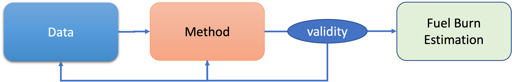

```{r setup, include=FALSE}
knitr::opts_chunk$set(
   echo = FALSE, message = FALSE, warning = FALSE    # generally silencing messages
  , dpi = 320                           # use a decent resolution for your graphics
  , dev = "ragg_png"                    # use ragg to make graphics in non-Latex "crisp"
  , fig.retina = 2                      # resolution and device, 2 is actually the default
  , fig.align = "center"                # well ... center the figure
  , fig.show = "hold"                   # prints and positions when chunk completed (pays out when multiple graphics in one chunk)
  , fig.width = 6, fig.asp = 0.618      # some "magic numbers" to visually appealing figure dimensions
  , out.width = "90%"                   # outside dim of figure based on line/page width
                      ) 

```

# Introduction

Climate change and the impact of air transportation is a top political priority.
The discussion is also amplified by the apparent reduction of emissions during COVID19.
Ambitious political goals have been formulated across the globe.
For example within the European context, the European Union initiated its "Green Deal"[@europeancommission2019].
This is complemented by the "Fit-for-55" package [@europeancommission2021].
The latter responds to the Paris Agreement [@UN_COP21_2015] setting out the global objective to reach carbon neutrality by 2050.
The aim of this package is to reduce green house gas emissions by 55% by 2030 as a stepping stone to meet the 2050 targets.

Given the political backdrop, there is an interest by the performance benchmarking community to develop approaches and methods to complement the existing framework of operational performance indicators proposed by ICAO's Global Air Navigation Plan [@icao_doc9750_2019].
During a recent PBWG meeting, the need for a "look-up table"-based approach had been identified.

This paper builds on discussions by the PBWG and develops an initial proposal for a look-up-table-based approach.
The approach is trialed as part of the bi-regional Brazilian-Europe Operational Comparison exercise.

# Background

## High-Level Overview

Despite its political relevance, environment oriented benchmarking is not common place.
Typically, environmental impacts are associated with operational efficiency metrics.
The latter provide measures for the level of inefficiency expressed in terms of additional time or additional distance flown.
Such inefficiencies can be directly linked to engine time and, thus, fuel burn and associated emissions.
With the on-going climate change discourse it is required to augment this operational view and develop methods supporting an environmental impact oriented discussion.
In a first instance, this requires a conversions of the existing efficiency indicators into fuel burn / CO2 emissions.

Within ICAO, noise and emission impacts of aviation are addressed somewhat independently.
The Committee on Aviation Environmental Protection (CAEP) developed standards for aircraft noise certification and engine emission certification.
With respect to noise, ICAO developed the balanced appraoch and its underpinning four main action areas: (i) reduction at source (e g quieter aircraft), (ii) land-use planning and management, (iii) noise abatement operational procedures, and (iv) operating restrictions.
With respect to emissions ICAO established guidance on local air quality [@icao2020] to address health concerns of pullutants for staff working/travelling public or population living in close proximity to aerodromes.
On the wider emission, ICAO's focus is on global emission inventories, including regional / national reporting.

`Note: previous para requires better references.`

Driven by the current political debate and the move towards decarbonising air transportation, the following four principal levers were introduced:

-   operational efficiency (infrastructure and operations);
-   sustainable aviation fuel;
-   new aircraft design and propulsion technology; and
-   market-based mechanism.

Improvements of operational efficiency are immediate near-term measures as the other initiatives will require more time and further research and development.
This comprises:

-   ICAO took initiative with respect to market-based mechanism. Decision A40-19 of the ICAO Assembly 40 established a Carbon Off-setting Scheme for Aviation (CORSIA) [@icao] and developed associated Standards and Recommended Practices for Annex 16 - Environmental Protection. CORSIA is currently in a voluntary pilot phase (2021-2023).
-   work on sustainable aviation fuel is on-going. However, industry-wide pick-up and provision still requires substantial investment in establishing the underlying refinery capacities and distribution networks.
-   aircraft engineering is a vibrant area with a variety of potential new designs. There is also increasing research and development aiming at novel propulsion systems or increasing fuel efficiency of today's mainstream engine technologies.

To address the current status-quo, performance comparisons / benchmarking activities can contribute to provide information on efficiency benefit pools and constraints on airspace users.
Next to the near-term dimension this can also be useful to inform the on-going debate on the environmental impact of air transportation on climate change and the contribution by air navigation services.

## Fuelburn Estimation - Available Public Datasets

As mentioned before, despite its political relevance, there is a shortage on publicly available information on aircraft fuel burn and emission.
This also impacts the state-of-the-art in environmental oriented operational performance monitoring and benchmarking work.

Conceptually, there are 3 broad approaches in the existing literature on which performance monitoring / benchmarking can build:

-   simplified / hollistic rule-of-thumbs
-   (agreed) grouped fuel burn estimates
-   fuel burn estimation modelling

Singh and Sharma [@singh2015] offer a classification of fuel estimation oriented research and identify dimensions of either the analytical or empirical work.
With increasing data-analytical capabilities there is a significant number of models to estimate fuel burn.

    to-do: expand on aforementioned groups & provide pointer to emission inventories

Publicly available datasets include:

-   ICAO Aircraft Engine Emission Databank (AEED) - This data set comprises characteristic engine data required for the actual engine certification (and compliance testing). The dataset includes fuel flow and emission indexes under 7%, 30%, 85%, and 100% of the rated power output for commercial jet and turbofan engines under sea level conditions.
-   ACERT v6 - ACI provides a tool for airports to assess and collect data for their emission inventory reporting. The tool covers wider requirements, however, contains a data table that provides a mapping between aircraft types and representative engines based on the AEED.
-   EEA/EMEP aviation emissions - As part of the wider cross-industry emission inventory reporting, EEA/EMEP published material for assessing aviation related emissions. The dataset builds on a set of aircraft types/representative engines and provides fuel estimates for certain stage lengths.
-   ICAO the Carbon Emission Calculator - a web-based tool to calculate fuel burn for aerodrome pairs. The underlying methodology document provides - similar to EEA/EMEP - a mapping of aircraft types and fuel burn for stage lengths.
-   various research papers - supporting research related data bases / mappings of aircraft types / engines and associated fuel burn for different flight phases.

```{=html}
<!-- -->
```
    to-do: provide pointers / references to the resources mentioned above.

Validation oriented research has shown that the robustness of estimation of fuel burn and pollutant emissions is strongly dependent on a variety of factors.
Thus, assumptions for aircraft / engine operations, times-in-mode, associated emission indexes of the publicly available resources tend to overestimate the fuel burn or implicitly do not account for specifics of operations.
Nonetheless, there is agreement that these data sources can serve as a basis for providing an upper bound on fuel burn / emission estimation.

```{=html}
<!-- e.g. FDR data has shown that assumptions on for TIM and EI need to be corrected, These studies showed by using FDR data to
determine taxi fuel consumption illustrates lower engine thrust and the importance of the number of accelerations events (stop/start). -->
```

FAA and EUROCONTROL offer supporting models for estimating fuel burn.
The Base of Aircraft Data (BADA) was originally designed for simulation purposes.
It supports to build flight trajectories based on weigth assumptions of the aircraft.
The underlying thrust model allows then to determine fuel flow for flight phases.
BADA makes use of aircraft manufacturer provided data.
The latter limits the use license to work that does not compare the performance of different aircraft.

Based on the existing state-of-the-art, there exists no ready-made data base that supports a "look-up table" type of approach.

# Conceptual Approach

## Data-analytical Workflow

As mentioned above, despite its political relevance consolidated resources to support operational performance analyses and quantify fuel burn or aircraft emissions are not existing.

This paper follows a data-driven approach without specific modelling (c.f. Figure \@ref(fig:fig-approach)).
The goal is to establish a "look-up-table"-based approach.

-   data - comprises the analytic flight-by-flight data and aircraft type specific fuel burn
    -   flight-by-flight analytic data represents the data collected and processed for the calculation of the respective performance metrics. For the efficiency indicators this includes flight related information (i.e. aircraft type) and movement times (e.g. actual off-block time, atual take-off time, departure stand, and departure runway).
    -   aircraft type dependent fuel burn (estimate)
-   method - for this initial exercise separate methods for the determination of taxi-time related fuel burn and fuel burn during the arrival phase were developed.
-   validity - the chosen approaches/methods were cross-checked based on their validity, in particular the acceptability of the made assumptions.
-   fuel burn estimation - the calculated fuel burn estimates for the phase of flight and associated inefficiencies.

<br><br/>

(ref:fig-approach) Principal data-driven approach of this study.    

```{r fig-approach, fig.cap="(ref:fig-approach)"}

```

## Additional Taxi-Time Emissions

# Results

# Conclusions

# References {.unnumbered}
