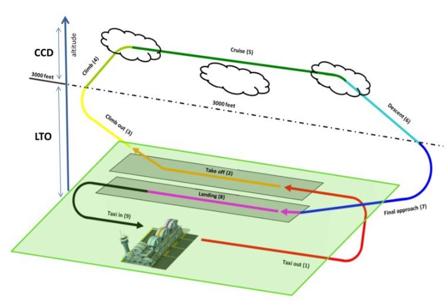

```{r, include=FALSE}
library(tidyverse)
```

This page documents the data preparatory action for constructing the look-up tables.    
The code is presented for reproducibility.    
The respective data files are stored in the subfolder **./data-analytic/**.

# LTO and CCD

```{r, fig.height=4}

```

Standards for certification of emissions produced by aircraft engines are determined in Volume II of Annex 16 of the International Civil Aviation Organization. 
The Standard focuses on the measurement of carbon monoxide (CO), unburned hydrocarbons (HC), nitrogen oxides (NOX), and smoke. 
Volume II of Annex 16 also sets a regulatory limit on the concentration of the mentioned emission products during the landing and takeoff cycle (LTO).

The LTO cycle comprises the landing, taxiing, and take-off from/up to an altitude of 3000ft.
According to the certification process, engines must be tested at various thrust settings representing the operations during the LTO cycle.

The associated data point conventions are

```{r}
thrust_mode_tbl <- 
  tibble::tribble(
    ~"Operating Mode", ~"Engine Thrust (%)", ~"Operating Time (min)"
    ,"Taxi-out", 7, 7.0
    ,"Take-off", 100, 0.7
    ,"Climb-out", 85, 2.2
    ,"Approach", 30, 4.0
    ,"Taxi-in", 7, 19
  )
thrust_mode_tbl %>% flextable::flextable()
```

Dependent on the work estimates for the complete LTO cycle are based on the associated "standard" times in the operating mode.
However, the table enables also to map actual observed movement times to the "standard" thrust setting (as established by ICAO) and derive associated fuel flow/burn estimates.


